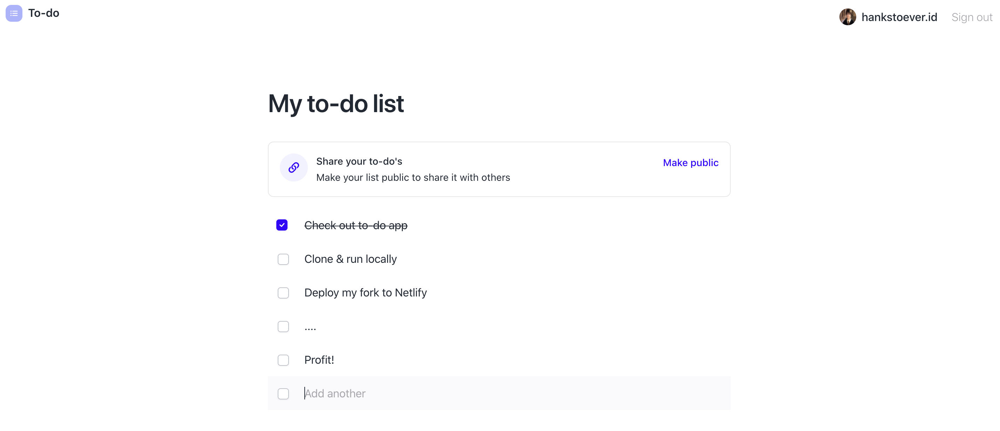

# Todos App with Stacks

A simple todos app that demonstrates how JavaScript apps can integrate functionality provided by [the Stacks network](https://stacks.co/) with [the Stacks.js library](https://github.com/blockstack/stacks.js).

[Try out the app as a user](https://todos.blockstack.org) or [learn how it works as a developer](https://docs.blockstack.org/authentication/building-todo-app).



Want to run the app locally and make changes?

Follow these instructions:

``` bash
git clone https://github.com/hirosystems/todos && cd todos
yarn install
yarn run start
```
